# Hướng dẫn Firebase Realtime Database trên Kodular
--------------
## Phần 1: Tạo Database
- Vào https://console.firebase.google.com và bấm **Add project** để tạo một project mới. 
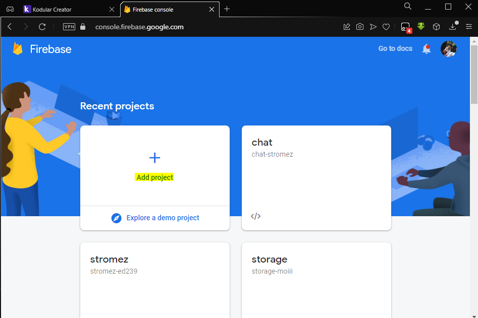
- Nhập tên project 
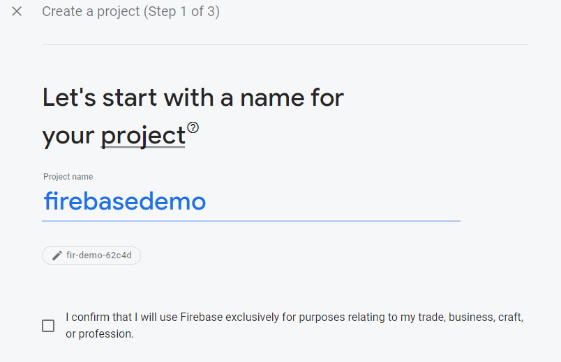
- Continue 
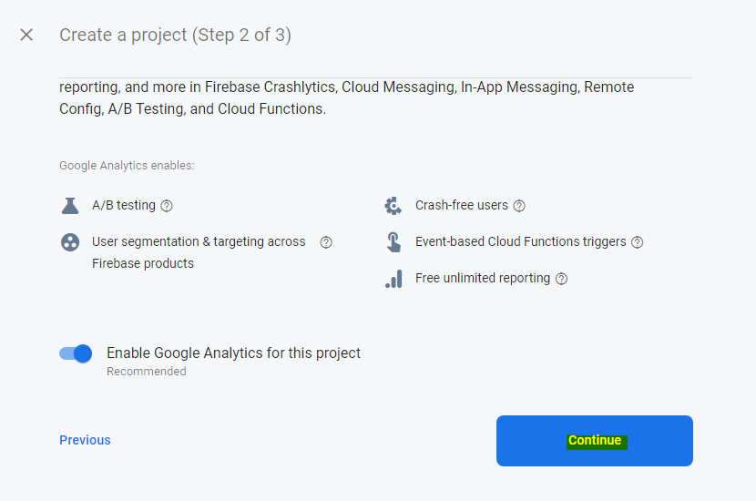
- Bấm theo hình và tạo project 
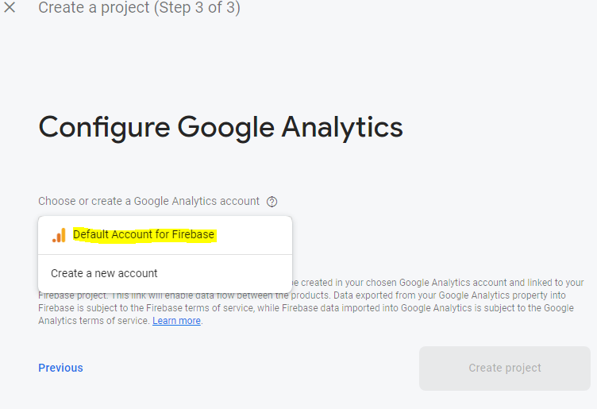
- Vào được trang như hình, bấm vào **Realtime Database** 
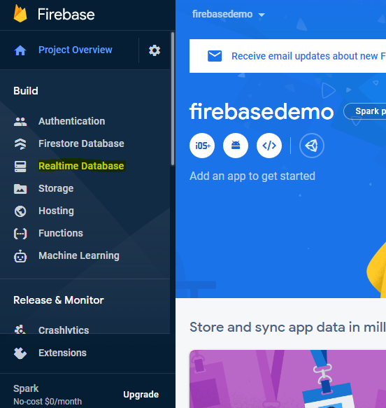
- Bấm **Create Database** để tạo Database 
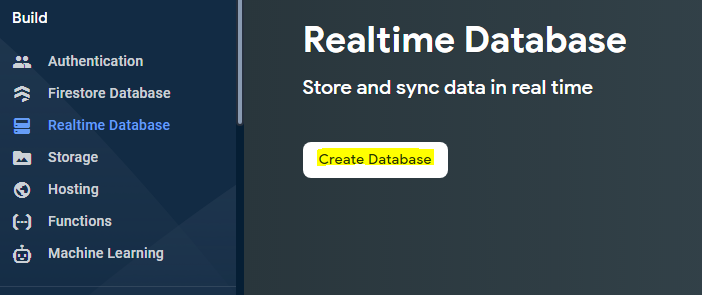
- Chọn khu vực 
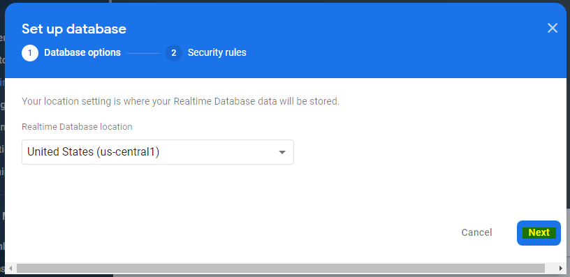
- Bảo mật:
  - Chọn **Start in locked mode** và bấm Enable 
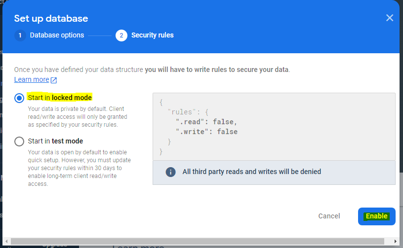
  - Sau khi vào được trang database, bấm vào trang **Rule**
    - Chỉnh tất cả *.read* và *.write* thành **True** 
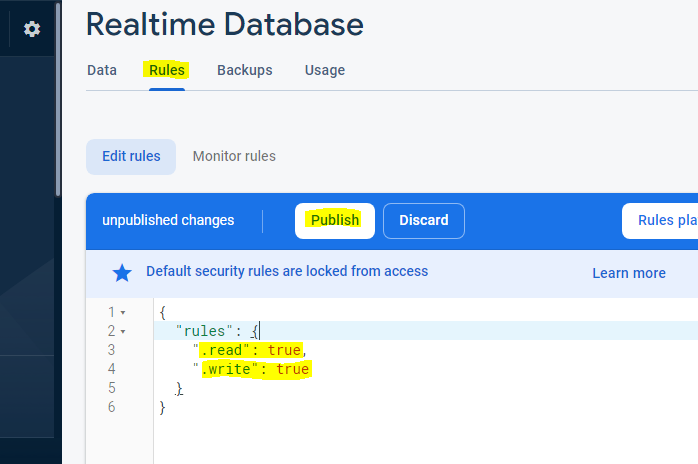
    - Bấm **Publish** để lưu
- Lấy mã Token để lưu và đọc dữ liệu:
  - Bấm vào *biểu tượng răng cưa* cạnh **Project Overview** tại góc trái màn hình
  - Bấm **Project Settings** 
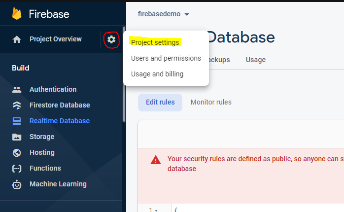
  - Vào được trang **Project Settings**, chọn trang **Service accounts**
    - Bấm vào **Database secrets** và copy hết phần Secret 
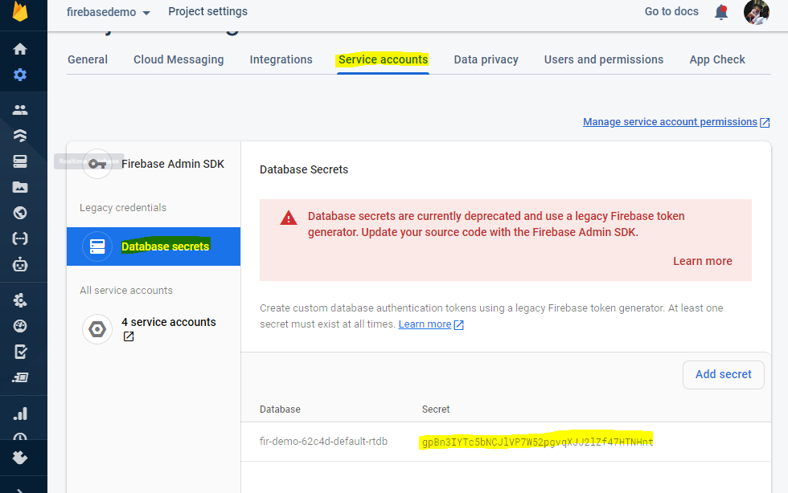
    - Vậy là đã lấy được token Database (1/2)
    > gpBn3IYTc5bNCJlVP7W52pgvqXJJ2lZf47HTNHnt
- Lấy URL Database:
  - Quay trở lại trang chủ của Realtime Database
  - Copy phần url bên trên 
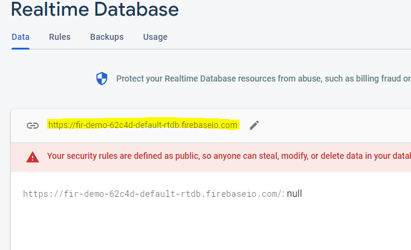
  - Vậy là đã lấy được URL Database (2/2)
  > https://fir-demo-62c4d-default-rtdb.firebaseio.com
****

## Phần 2: Liên kết Firebase Realime Database với Kodular
- Kéo Plugin **Firebase Database** từ phần **Google** vào Screen 
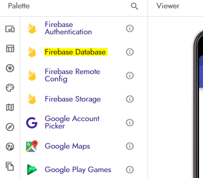
- Setting thuộc tính Plugin như sau:
  - **Firebase Token**: *Token đã copy từ bước trên*
  - **Firebase URL**: *URL đã copy từ bước trên*
  - **Project bucket**: *Để trống* 
  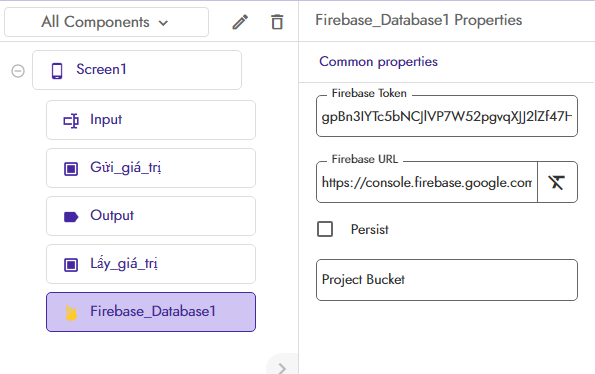

## Phần 3: Sử dụng Firebase Realime Database
- *Ví dụ cách setup các block để có thể Gửi, Nhận dữ liệu từ Database:* 

- *Ví dụ code và hướng dẫn cụ thể:* 
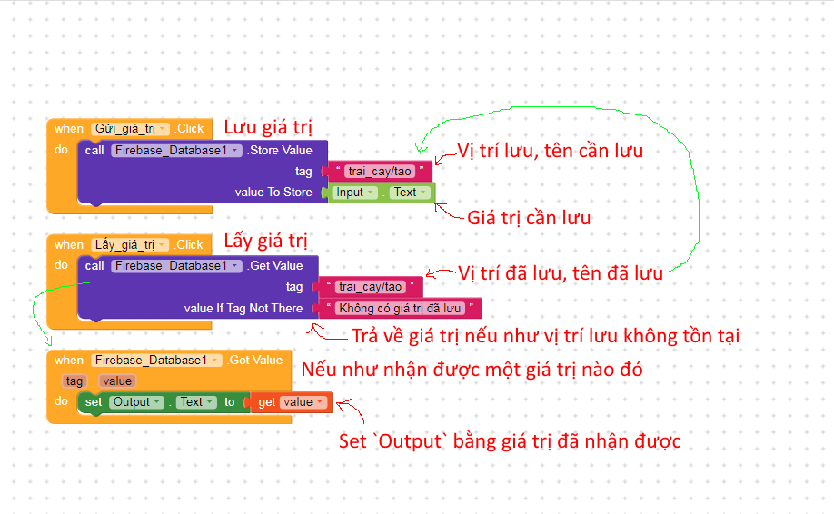

## Phần 4: Ví dụ khi sử dụng Firebase Realime Database
- Nếu nhập giá trị = 3 và bấm button **Gửi lên database** 
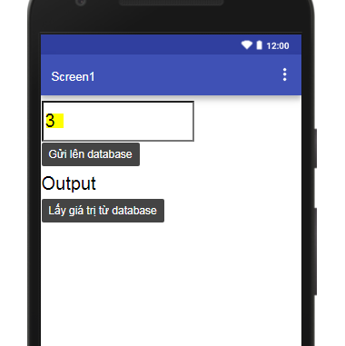
- Database sẽ xuất hiện tại vị trí 'trai_cay' giá trị 'tao'='3'  
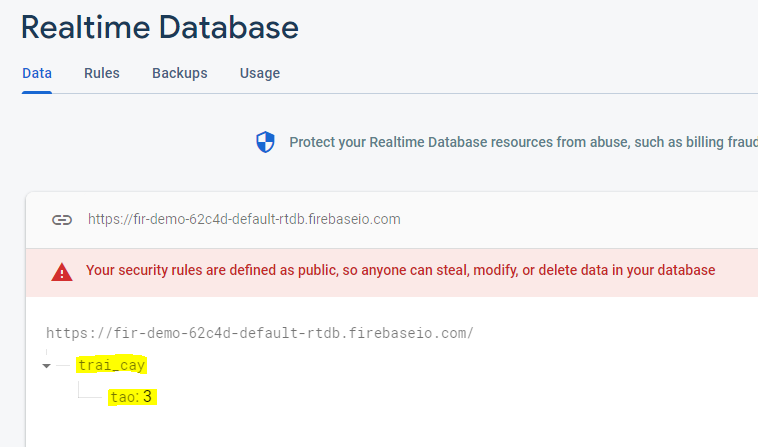
- Sau khi bấm nút **Lấy giá trị từ database** thì Output sẽ hiện giá trị 3 
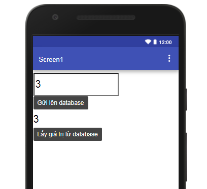
- Nếu như giá trị 'tao' chưa được lưu, Output sẽ hiển thị *Không có giá trị đã lưu* 
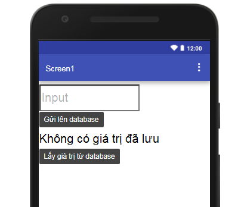

***
# By [Minhmoiii](https://qminh.xyz/fb)
Nếu có thắc mắc gì thì ib trực tiếp qua: https://qminh.xyz/fb
